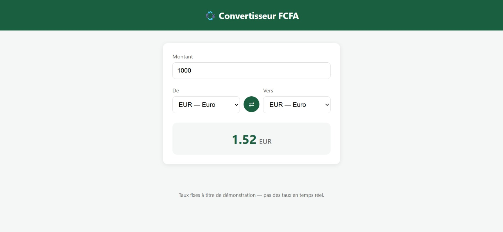
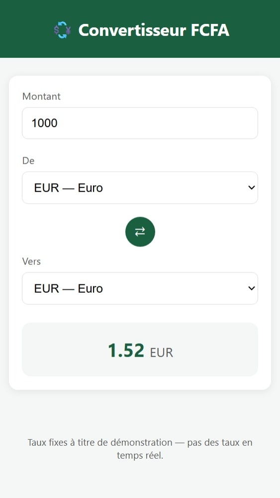

# 💱 Convertisseur FCFA

Application Angular moderne de conversion entre le Franc CFA (XAF) et d'autres devises (EUR, USD, GBP), avec calcul réactif en temps réel.

## Fonctionnalités
- Conversion instantanée entre 4 devises (FCFA, Euro, Dollar US, Livre Sterling)
- Inversion rapide des devises source/cible en un clic
- Calcul entièrement réactif : le résultat se met à jour automatiquement à chaque saisie
- Interface responsive (mobile, tablette, desktop)

### Desktop


### Mobile


## Stack technique
- Angular (dernière version), composants standalone
- Signals (`signal`, `computed`) pour un état 100% réactif
- Aucune dépendance externe, aucun appel réseau — calcul entièrement côté client
- Pipe `number` pour le formatage des résultats

## Fonctionnement
Le taux de chaque devise est exprimé en "combien de FCFA pour 1 unité". La conversion passe systématiquement par le FCFA comme pivot :

```
montant → FCFA (via la devise source) → devise cible
```

Le signal `computed()` recalcule automatiquement le résultat dès que le montant, la devise source, ou la devise cible change — sans code manuel de synchronisation.

## Lancer le projet

```bash
npm install
ng serve -o
```

## Démo
[https://convertisseurs-monnaie.vercel.app/]